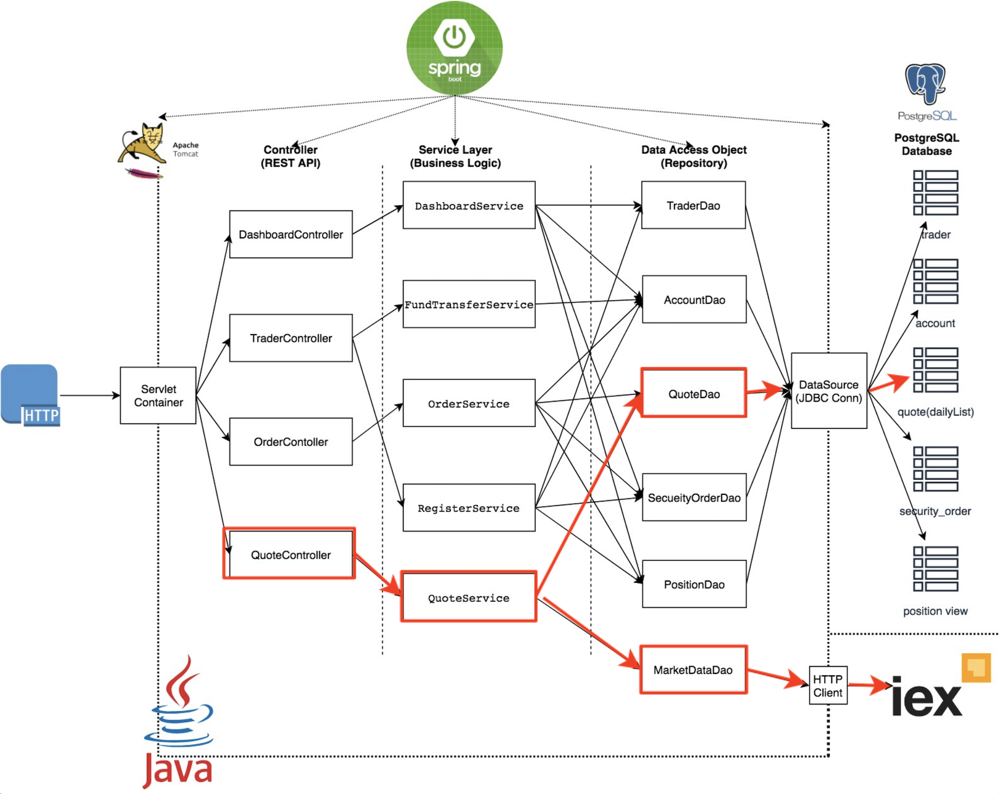
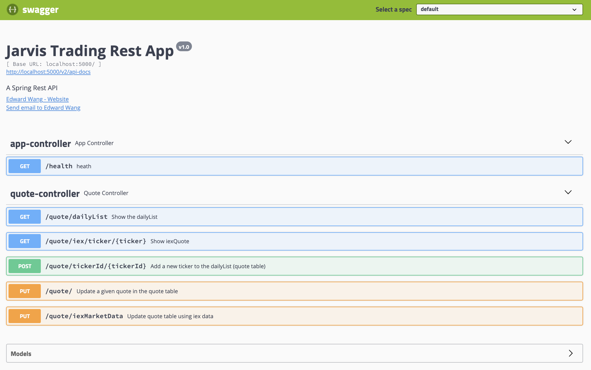
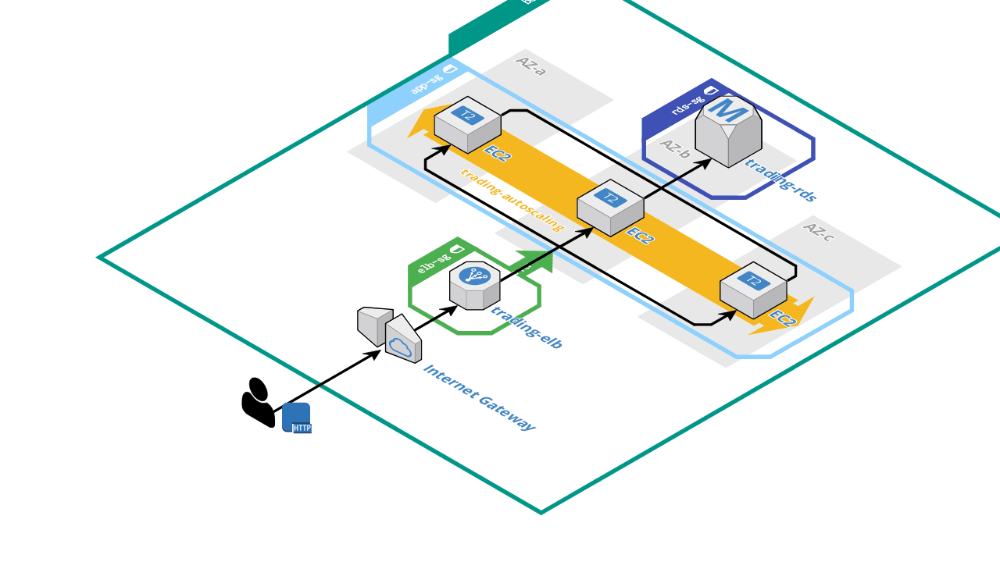
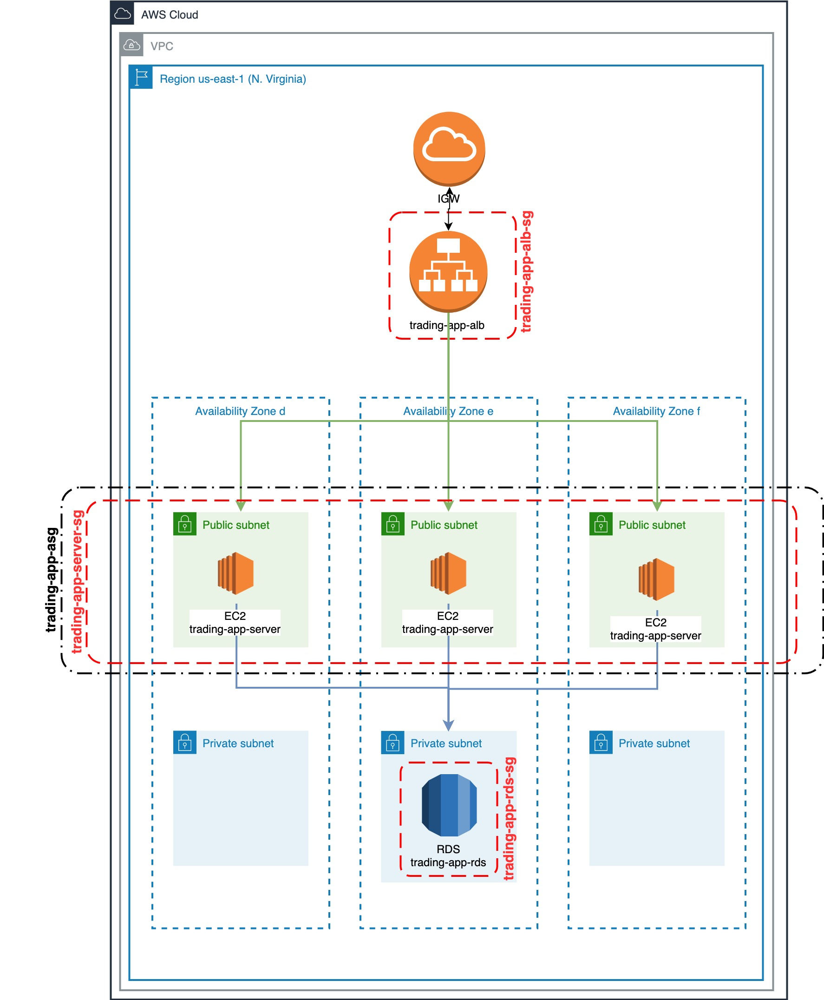

# Introduction
This project using AWS cloud service(EC2,RDS,EB,Jenkins and etc) to manage the online stock trading simulation REST API which can handle options for user to manage their trading account,buy and sell stock,get the latest data from the stock market,and ect.

# Overall Steps
- Docker containerize trading-app
  - Step1.Start Docker
  - Step2.Creating a network brige
  - Step3.Building PSQL image
  - Step4.Building trading-app image
  - Step5.Connect the trading-app
- Migrating trading-app to AWS cloud service
  - Step1.Creating a  new application and envusing AWS Elastic Beanstalk to help us manage and dev the project.
  - Step2.Figure out all the config:Security group,ec2 instances,RDS,etc.
  - Step3.Edit pom file and assembly file make sure your code can talk to EB.
  - Step4.Download the latest source code of Jenkins from GitHub.
  - Step5.Complie and package source code.
  - Step6.Deploy to eb envir using EB CLI.

# Docker CLI
```BASH
#auto start
sudo systemctl enable docker
#start service
sudo systemctl start docker
sudo docker -v
#Creating a network bridge
sudo docker network create --driver bridge trading-net
#Building PSQL image
git clone git@github.com:keshang-xxpk/Cloud_devOps.git
cd trading_app/psql
#ls image
docker image ls

#check Docker file
cat Dockerfile

#build docker image
docker build -t jrvs-psql .

#run psql
#attach this container to the network bridge
sudo docker run --rm --name jrvs-psql \
--restart unless-stopped \
-e POSTGRES_PASSWORD=password \
-e POSTGRES_DB=jrvstrading \
-e POSTGRES_USER=postgres \
--network trading-net \
-d -p 5432:5432 -t jrvs-psql

#list runing containers
docker container ls
#Building trading app image
cd trading_app/

#check Docker file
cat Dockerfile

#build trading app
docker build -t trading-app .

IEX_TOKEN='your_token'

sudo docker run --rm --name trading-app-v1 \
--restart unless-stopped \
-e 'PSQL_URL=jdbc:postgresql://jrvs-psql:5432/jrvstrading' \
-e 'PSQL_USER=postgres' \
-e 'PSQL_PASSWORD=password' \
-e "IEX_PUB_TOKEN=${IEX_TOKEN}" \
--network trading-net \
-p 8080:8080 -t trading-app

#list running containers
docker container ls

#verify health
curl localhost:8080/health
#verify Swagger UI from your browser
localhost:8080/swagger-ui.html
```
# Setup Jenkins Instance CLI
```BASH
#default user name is ubuntu
ssh-i ~/.ssh/pem/your_pem.pem ubuntu@ec_pub_ip
sudo su - 
cd /tmp
#install jenkins repo
wget http://pkg.jenkins-ci.org/debian-stable/jenkins-ci.org.key
apt-key add jenkins-ci.org.key
echo"deb http://pkg.jenkins-ci.org/debian binary/" >
/etc/apt/sources.list.d/jenkins.list

#install java nginx Jenkins
apt update
apt install -y openjdk-8-jdk nginx jenkins python-pip maven
sleep1

#install elastic beanstalk cli tool
pip install --system awsebcli
```
# EB CLI
```BASH
#ssh Jenkins instance
cd ~
git clone https://your_trading_app_url
cd your_app_dir
mvn clean package -DskipTests

#remove exiting EB config
rm -rf .elasticbeanstalk

#init eb for the project
eb init trading-app --platform java --region us-east-1-rf .elasticbeanstalk
eb use TradingApp-prod
#Edit EB config file which tells EB which artifact to deploy
cat >> .elasticbeanstalk/config.yml <<_EOF
deploy:
   artifact: target/trading-1.0-SNAPSHOT-elastic-beanstalk.zip
 _EOF
#deploy
eb deploy
```
# Trading-app Architecture Diagram


# Docker Architecture Diagram
- trading_app docker diagram including:
 - use draw.io and AWS icons (it's already in draw.io library)
 - images (docker hub and local)
 - bridge network
 - containers
 - label commands

- Two docker files
  - trading-app
   - talk about the process (e.g. compile and package jar and run the app)
  - jrvs-psql
   - talk about how to create tables (e.g. schema.sql)
   

# Cloud Architecture Diagram
- trading app diagram
  - use draw.io and aws icons (it's in the draw.io library)
  - include ec2, alb, auto scaling, target group, rds
  - security groups
  - label all important ports(e.g. ALB HTTP, ec2 tpc:5000, RDS tcp:5432)
  
# AWS EB and Jenkins CI/CD Pipeline Diagram
- Please refer to Jenkins guide architecture diagram.


# `trading_app` Demo project

This project only keeps the red component in the diagram below for demo and cloud deployment learning purpose.


# Quicker Start

**Prerequisites:**

* Docker (17.05 or higher which support multi-stage build)
* IEX token for getting market data (`https://iexcloud.io/docs/api/`) 

**Commands**

```bash
#you may or may not need sudo for docker cmds

#start docker
sudo systemctl start docker
#17.05 or higher
sudo docker -v

#create network bridge between SpringBoot app and postgreSQL
sudo docker network create --driver bridge trading-net

#build trading app
sudo docker build -t trading-app .

#build psql image
cd psql/
sudo docker build -t jrvs-psql .

#run a psql container
sudo docker run --rm --name jrvs-psql \
-e POSTGRES_PASSWORD=password \
-e POSTGRES_DB=jrvstrading \
-e POSTGRES_USER=postgres \
--network trading-net \
-d -p 5432:5432 jrvs-psql

#Setup IEX token
IEX_TOKEN='your_IEX_token'
#run a trading_app container
sudo docker run \
-e "PSQL_URL=jdbc:postgresql://jrvs-psql:5432/jrvstrading" \
-e "PSQL_USER=postgres" \
-e "PSQL_PASSWORD=password" \
-e "IEX_PUB_TOKEN=${IEX_TOKEN}" \
--network trading-net \
-p 5000:5000 -t trading-app

#verify health
curl localhost:5000/health
#verify Swagger UI from your browser
localhost:5000/swagger-ui.html

```

**Swagger-UI page**



# Cloud Deployment

## 3D Architecture Diagram




## Detailed Architecture Diagram


